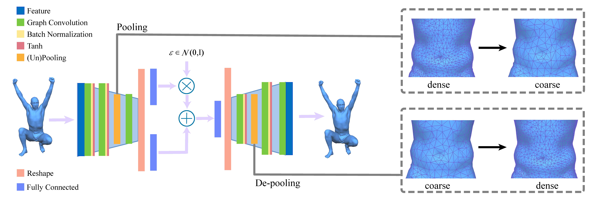

# Mesh Variational Autoencoders with Edge Contraction Pooling
Code for '[Mesh Variational Autoencoders with Edge Contraction Pooling](http://www.geometrylearning.com/meshpooling_cvprw2020.pdf)'.



## Abstract
3D shape analysis is an important research topic in computer vision and graphics. While existing methods have generalized image-based deep learning to meshes using graph-based convolutions, the lack of an effective pooling operation restricts the learning capability of their networks. In this paper, we propose a novel pooling operation for mesh datasets with the same connectivity but different geometry, by building a mesh hierarchy using mesh simplification. For this purpose, we develop a modified mesh simplification method to avoid generating highly irregularly sized triangles. Our pooling operation effectively encodes the correspondence between coarser and finer meshes in the hierarchy. We then present a variational auto-encoder (VAE) structure with the edge contraction pooling and graphbased convolutions, to explore probability latent spaces of 3D surfaces and perform 3D shape generation. Our network requires far fewer parameters than the original mesh VAE and thus can handle denser models thanks to our new pooling operation and convolutional kernels. Our evaluation also shows that our method has better generalization ability and is more reliable in various applications, including shape generation and shape interpolation. 

## Requirements
TensorFlow 1.15

## Usage
1. You should calculate ACAP feature for the shapes in the dataset and perform edge contraction for the first shape (typically the neutral pose). In "Matlab" folder, see and run `preprocess.m`. Note: We rename all models into natural number.
2. The computed mat file will be in `[path to your data]\rename\feature`, named as `vertFeaturepoolingc.mat`. You may copy it to the folder included the network python code and replace the character `c` in the name with the name of the shape dataset, such as `vertFeaturepoolingscape.mat`.
3. Cd into the python code dir and run
```
python main.py --model scape --gpu 0
```
4. After traning, use `recon_script.m` to reconstruct the shape.

## Citation
If you use the code in your research, please cite:
```
@inproceedings{yuan2020mesh,
	title={Mesh variational autoencoders with edge contraction pooling},
	author={Yuan, Yu-Jie and Lai, Yu-Kun and Yang, Jie and Duan, Qi and Fu, Hongbo and Gao, Lin},
	booktitle={Proceedings of the IEEE/CVF Conference on Computer Vision and Pattern Recognition Workshops},
	pages={274--275},
	year={2020}
}
```